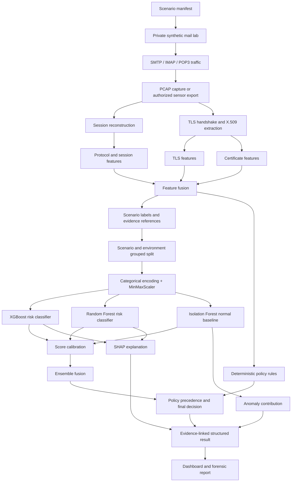

# SecureMailScope ML Pipeline and Synthetic Dataset Factory

**Status:** Implementation-ready specification v0.1
**Date:** 2026-09-04
**Scope:** ML feature engineering, synthetic data generation, model training, inference, fusion, explainability, and evaluation
**Implementation status:** Partially implemented; see the repository README for current code/spec alignment.

## 1. Purpose

This document defines the first coding-ready ML slice for SecureMailScope.
The slice converts structured SMTP, IMAP, and POP3 session observations into:

1. A supervised cryptographic risk classification.
2. An unsupervised behavioral anomaly score.
3. Feature-level explanations.
4. A policy-aware, evidence-linked result for the dashboard and forensic report.

The ML layer is advisory. Deterministic protocol, TLS, certificate, and
cryptographic rules remain the source of truth for security findings.

## 2. Product boundary

SecureMailScope is a passive email-network security assessment platform.

### In scope

- PCAP files from an authorized capture or an isolated synthetic mail lab.
- SMTP, IMAP, and POP3 session reconstruction.
- STARTTLS behavior and TLS handshake metadata.
- X.509 certificate metadata.
- Session-level behavioral features.
- Synthetic scenario generation with ground-truth labels.
- XGBoost and Random Forest risk classification.
- Isolation Forest anomaly detection.
- MinMaxScaler preprocessing.
- SHAP explanations for supervised tree models.
- Evidence references back to sessions and packet ranges.

### Out of scope for this slice

- Reading or storing email bodies.
- Collecting mailbox passwords or production credentials.
- Automatically blocking mail or changing server configuration.
- Treating Roundcube UI actions as the ML input.
- Using an LLM as the primary detector.
- Training on the friend's production traffic.
- Claiming that synthetic performance represents production performance.

Roundcube is an optional browser-based client used to create realistic mail
traffic. The actual traffic source is the SMTP/IMAP/POP3 path provided by the
mail server and its clients.

## 3. Decisions fixed by this specification

| Decision | Specification |
|---|---|
| Scenario partitioning | Split scenarios into three feature views: protocol/session, TLS negotiation, and certificate posture. Do not split email bodies. |
| Model topology | Run XGBoost, Random Forest, and Isolation Forest in parallel. Do not feed one model's prediction into another model. |
| Scaling | Use MinMaxScaler for numeric model features. Fit it on training data only and persist it with the model bundle. |
| Categorical data | Impute missing values and use one-hot encoding with unknown-category handling. |
| Isolation Forest | Fit only on normal baseline sessions. Treat an anomaly as a behavioral signal, not proof of maliciousness. |
| Explanations | Use SHAP for XGBoost and Random Forest. Use a documented anomaly-contribution method for Isolation Forest. |
| Fusion | Calibrate model outputs before combining them. Start with a configured weighted fusion baseline, then benchmark learned stacking separately. |
| Security rules | Deterministic rules can establish a finding and a minimum severity. Models can prioritize and add context but cannot erase rule evidence. |
| Data source | Generate the training set in a private lab. Use authorized real captures only as a separately labeled validation set. |

## 4. Terminology

- **Capture:** One PCAP file or one authorized sensor export.
- **Flow:** A bidirectional network flow identified by endpoints and protocol.
- **Session:** A reconstructed application-layer interaction, such as one SMTP
  STARTTLS session or one IMAP TLS session.
- **Scenario:** A controlled configuration and behavior that produces one or
  more labeled sessions.
- **Feature view:** A logical group of session features used for analysis and
  explanation.
- **Risk label:** The expected cryptographic/security impact of a scenario.
- **Anomaly label:** Whether a scenario is intentionally outside the normal
  behavioral baseline.
- **Finding:** A deterministic, evidence-backed security observation with a
  stable finding ID.
- **Model bundle:** The preprocessor, models, calibration parameters,
  thresholds, feature map, and metadata required for reproducible inference.

## 5. End-to-end architecture



The three feature views are joined into one session vector before model
inference. This keeps every model aware of the complete security context while
preserving group-level explanations.

## 6. Target repository structure

```text
securemailscope/
├── ml/
│   ├── __init__.py
│   ├── schema.py             # Pydantic models and enums
│   ├── features.py           # feature extraction adapter and feature map
│   ├── preprocess.py         # imputation, encoding, MinMaxScaler
│   ├── dataset.py            # dataset assembly and split logic
│   ├── models.py             # XGBoost, Random Forest, Isolation Forest
│   ├── calibration.py        # score calibration and thresholds
│   ├── fusion.py             # ensemble and rule precedence
│   ├── explain.py            # SHAP and anomaly contributions
│   ├── evaluate.py           # metrics and evaluation reports
│   ├── artifacts.py          # model bundle persistence and hashes
│   └── pipeline.py           # training and inference orchestration
├── dataset/
│   ├── scenarios/
│   │   ├── catalog.yaml
│   │   └── manifests/
│   ├── generators/
│   ├── lab/
│   ├── pcaps/
│   ├── extracted/
│   ├── splits/
│   └── README.md
├── models/
├── tests/
│   ├── unit/
│   ├── integration/
│   └── fixtures/
├── configs/
│   ├── dataset.example.yaml
│   └── training.example.yaml
└── docs/
    └── securemailscope-ml-pipeline-spec.md
```

The first implementation may use a pure feature-only generator for fast tests.
The PCAP lab adapter is added after the schema and model contract are stable.

## 7. Dependencies

### Required for the first ML slice

- Python 3.11 or newer.
- pydantic for contract validation.
- numpy for numeric operations.
- pandas for the initial dataset table.
- scikit-learn for preprocessing, Random Forest, Isolation Forest, metrics,
  and calibration utilities.
- xgboost for supervised risk classification.
- shap for tree-model explanations.
- joblib for local model persistence.
- pyarrow for Parquet datasets.
- pytest for tests.

### Optional lab dependencies

- Docker and Docker Compose.
- Postfix for SMTP.
- Dovecot for IMAP.
- Roundcube for browser-generated client behavior.
- tcpdump or Zeek for capture and protocol metadata.
- Scapy or a dedicated parser adapter for PCAP ingestion.

Dependency versions must be recorded in the dataset and model manifests.

## 8. Canonical data contracts

### 8.1 Feature record

The canonical unit of ML inference is one reconstructed session. Identifiers,
labels, provenance, and model features are kept in separate sections.

```json
{
  "schema_version": "session-features.v1",
  "provenance": {
    "capture_id": "cap_000001",
    "flow_id": "flow_000042",
    "session_id": "sess_000042",
    "source_type": "synthetic_pcap",
    "scenario_id": "normal_tls13_valid",
    "environment_id": "lab_seed_0042",
    "generator_seed": 420042,
    "evidence_refs": [
      {
        "source": "pcap",
        "stream_id": 7,
        "packet_start": 128,
        "packet_end": 143,
        "fields": ["tls_version", "cipher_suite"]
      }
    ]
  },
  "features": {
    "protocol": "SMTP",
    "src_port": 49821,
    "dst_port": 587,
    "starttls_advertised": true,
    "starttls_used": true,
    "tls_version": "TLS1.3",
    "cipher_suite": "TLS_AES_256_GCM_SHA384",
    "cipher_family": "AES-GCM",
    "key_exchange": "ECDHE",
    "signature_algorithm": "RSA-PSS",
    "forward_secrecy": true,
    "handshake_success": true,
    "handshake_failures": 0,
    "renegotiation_count": 0,
    "session_duration_seconds": 4.82,
    "packet_count": 182,
    "byte_count": 28491,
    "retransmission_count": 0,
    "out_of_order_count": 0,
    "cert_present": true,
    "cert_valid": true,
    "cert_expired": false,
    "cert_expires_in_days": 241,
    "cert_chain_valid": true,
    "hostname_mismatch": false,
    "cert_key_algorithm": "RSA",
    "cert_key_length_bits": 2048,
    "cert_signature_algorithm": "SHA256-RSA"
  },
  "labels": {
    "risk_label": "informational",
    "anomaly_label": 0,
    "expected_finding_ids": []
  }
}
```

### 8.2 Enumerations

```text
protocol:
  SMTP | IMAP | POP3

source_type:
  synthetic_feature | synthetic_pcap | authorized_capture

risk_label, ordered from lowest to highest:
  informational | low | medium | high | critical

model_action:
  no_action | monitor | analyst_review | prioritize | critical_review
```

Nullable feature values are permitted when the protocol does not expose the
field. For example, certificate fields may be null when a TLS handshake was not
completed. Missing values must be represented consistently and handled by the
preprocessor; empty strings must not be used as an accidental second missing
value.

### 8.3 Evidence references

Every feature that can influence a security result must be traceable to one of:

- A packet range in the input PCAP.
- A reconstructed flow/session event.
- A synthetic scenario configuration entry.

The feature extractor must preserve packet and session provenance even when the
model input contains only encoded numeric values.

## 9. Feature views

### 9.1 Protocol and session view

```text
protocol
src_port
dst_port
starttls_advertised
starttls_used
handshake_success
handshake_failures
renegotiation_count
session_duration_seconds
packet_count
byte_count
retransmission_count
out_of_order_count
```

### 9.2 TLS negotiation view

```text
tls_version
cipher_suite
cipher_family
key_exchange
signature_algorithm
forward_secrecy
```

### 9.3 Certificate posture view

```text
cert_present
cert_valid
cert_expired
cert_expires_in_days
cert_chain_valid
hostname_mismatch
cert_key_algorithm
cert_key_length_bits
cert_signature_algorithm
```

### 9.4 Features excluded from model input

- Raw email body, subject, attachment, or message text.
- Passwords, authorization headers, cookies, or tokens.
- Raw source/destination IP addresses as predictive features.
- Session IDs, capture IDs, timestamps used as identifiers, and scenario IDs.
- Any field that directly reveals the synthetic label.

Endpoint grouping and timestamps may be retained for splitting, monitoring, or
provenance, but must not silently enter the model matrix.

## 10. Preprocessing contract

The preprocessor is part of the model bundle and is never rebuilt separately
at inference time.

### 10.1 Validation

Before transformation:

1. Validate the record against session-features.v1.
2. Reject unknown top-level fields only when strict mode is enabled.
3. Preserve unknown feature values for diagnostic reporting.
4. Reject impossible values, such as negative duration or packet count.
5. Allow nulls only for fields marked nullable.

### 10.2 Numeric pipeline

```text
numeric features
  -> median imputation fitted on training data
  -> MinMaxScaler(feature_range=(0, 1), clip=True)
```

The numeric feature list and order are persisted. Boolean fields are converted
to 0 and 1 before scaling. The scaler is fit only on the training split.
Validation, test, and production data are transformed with the persisted
training scaler.

### 10.3 Categorical pipeline

```text
categorical features
  -> constant imputation with "__MISSING__"
  -> OneHotEncoder(handle_unknown="ignore")
```

Unknown production categories must not crash inference. They must be recorded
in diagnostics and mapped through the configured unknown-category behavior.

### 10.4 Feature map

The preprocessor must persist a mapping similar to:

```json
{
  "tls_version__TLS1.3": {
    "source_feature": "tls_version",
    "feature_view": "tls",
    "display_name": "TLS version"
  },
  "cert_key_length_bits": {
    "source_feature": "cert_key_length_bits",
    "feature_view": "certificate",
    "display_name": "Certificate key length"
  }
}
```

This map is required to turn transformed-model explanations back into human
readable feature names and feature views.

## 11. Synthetic dataset factory

### 11.1 Lab topology

```text
scenario manifest
        |
        v
scenario runner
   |              |
   v              v
synthetic client   TLS/certificate configuration
   |
   v
Postfix SMTP + Dovecot IMAP
   |
   v
tcpdump / Zeek sensor
   |
   v
PCAP + capture manifest
   |
   v
SecureMailScope feature extractor
   |
   v
session feature rows + labels
```

Roundcube is optional in this topology. It can be used for a small smoke test
of realistic browser-driven mailbox behavior. Headless SMTP/IMAP clients are
preferred for repeatable scale and precise scenario control.

### 11.2 Generator modes

| Mode | Purpose | Evidence status |
|---|---|---|
| synthetic_feature | Fast unit tests and model pipeline tests without networking | Synthetic feature provenance only |
| synthetic_pcap | End-to-end PCAP, reconstruction, extraction, and labeling | Packet-backed synthetic evidence |
| authorized_capture | Validation against a permitted external or friend-hosted server | Real capture, excluded from initial training |

The feature-only generator must be clearly marked so it is never presented as
packet-observed data.

### 11.3 Scenario manifest

Each scenario is a declarative record. The runner reads the record, configures
the isolated lab, drives one or more sessions, captures traffic, and emits
ground-truth labels.

```yaml
schema_version: scenario.v1
scenario_id: weak_tls_expired_cert
family: cryptographic_weakness
description: TLS 1.0 with 3DES and an expired certificate
protocol: SMTP
risk_label: critical
anomaly_label: 1
expected_finding_ids:
  - TLS-001
  - TLS-002
  - CERT-001
tls:
  version: TLS1.0
  cipher_suite: 3DES
  key_exchange: RSA
  forward_secrecy: false
certificate:
  state: expired
  key_algorithm: RSA
  key_length_bits: 1024
client_behavior:
  starttls_advertised: true
  starttls_used: true
  handshake_attempts: 1
variation:
  duration_seconds: [1.0, 8.0]
  packet_count: [80, 260]
  byte_count: [8000, 45000]
repetitions: 100
seed: 420042
```

The scenario label is ground truth from the manifest. It must not be inferred
from the output of the same ML pipeline being evaluated.

### 11.4 Scenario catalog

The initial catalog must include the following families. Exact policy severity
remains configurable in the deterministic policy pack, but the dataset catalog
must record one explicit expected label for each generated row.

| Scenario | Expected risk | Anomaly label | Expected deterministic findings |
|---|---:|---:|---|
| normal_tls13_valid | informational | 0 | none |
| normal_tls12_valid | informational | 0 | none |
| starttls_used_successfully | informational | 0 | none |
| deprecated_tls | critical | 1 | TLS-001 |
| weak_cipher | critical | 1 | TLS-002 |
| rsa_no_forward_secrecy | high | 1 | FS-001 |
| expired_certificate | high | 1 | CERT-001 |
| invalid_certificate_chain | high | 1 | CERT-003 |
| hostname_mismatch | high | 1 | CERT-004 |
| weak_rsa_key | high | 1 | CERT-002 |
| starttls_advertised_unused | high | 1 | STLS-001 |
| starttls_handshake_failure | high | 1 | STLS-002 |
| repeated_handshake_failures | high | 1 | ANOM-001 |
| unusual_cipher_negotiation | medium | 1 | ANOM-002 |
| unexpected_tls_version | medium | 1 | ANOM-003 |
| multiple_renegotiations | high | 1 | ANOM-004 |
| combined_critical_weaknesses | critical | 1 | multiple rule IDs |

For scenarios involving legacy protocols or ciphers, the lab must use a
dedicated legacy-compatible container or test endpoint. If the host crypto
library refuses to negotiate the scenario, the run must be marked
unsupported_in_lab rather than silently pretending that the PCAP was observed.

### 11.5 Traffic variation

Within a scenario, vary behavior without changing its label:

- Session duration.
- Packet count and byte count.
- Number of normal SMTP/IMAP commands.
- Client/server timing jitter.
- Benign retransmissions and out-of-order packets.
- Number of failed handshake attempts where the scenario requires failures.

Do not vary a feature in a way that contradicts the scenario. For example, a
normal_tls13_valid row cannot have cert_expired=true.

### 11.6 Initial dataset size and distribution

The default release target is 5,000 to 10,000 sessions. The generator accepts
an explicit count and scenario distribution. A practical starting distribution
is:

```text
normal baseline sessions:       60%
single cryptographic weakness:  25%
behavioral anomaly scenarios:   10%
combined weakness scenarios:     5%
```

The training set may rebalance rare classes using sample weights. The test set
must preserve its configured scenario distribution and must not be duplicated
or oversampled without recording that decision.

### 11.7 Reproducibility

Every generated run must record:

- Master seed.
- Derived scenario seed.
- Scenario ID and manifest hash.
- Environment ID.
- Container image digests.
- Feature extractor version.
- Operating system and dependency versions.
- Git commit or source revision when available.
- Raw PCAP hash.
- Extracted dataset hash.

Suggested deterministic seed derivation:

```text
scenario_seed = stable_hash(master_seed, scenario_id, repetition_index)
```

The same configuration and seed must produce the same manifest, feature rows,
labels, split assignment, and artifact hashes, except for explicitly recorded
capture timestamps.

### 11.8 Dataset layout

```text
dataset/runs/<run_id>/
├── run_manifest.json
├── scenario_manifest.jsonl
├── pcaps/
│   ├── cap_000001.pcap
│   └── ...
├── extracted/
│   ├── session_features.jsonl
│   └── session_features.parquet
├── splits/
│   ├── train.parquet
│   ├── validation.parquet
│   └── test.parquet
└── checksums.sha256
```

## 12. Dataset splitting and leakage prevention

The default split is grouped, not a random row split.

### Required grouping keys

- scenario_id.
- environment_id.
- Parameter combination hash.
- Capture ID.

All rows from one capture remain in one split.

### Default split

```text
train:      70% of grouped runs
validation: 15% of grouped runs
test:       15% of grouped runs
```

The test set must contain:

- New seeds.
- A held-out environment ID.
- At least some held-out parameter combinations.
- Combined scenarios not copied verbatim from training.

No model threshold, fusion weight, or explanation top-k setting may be tuned on
the test set.

## 13. Model specifications

All three models receive the combined preprocessed vector in the initial
baseline. Feature-view-specific models may be added later as an ablation
experiment, but they are not the default because a model that sees only one
view can miss corroborating TLS or certificate evidence.

### 13.1 XGBoost risk classifier

**Purpose:** Primary supervised classifier for the ordered risk classes.

```text
input:  combined encoded and scaled session vector
target: informational, low, medium, high, critical
output: calibrated class probabilities and predicted class
```

Initial baseline configuration:

```text
objective: multi:softprob
eval_metric: mlogloss
tree_method: hist
n_estimators: 300
max_depth: 5
learning_rate: 0.05
subsample: 0.8
colsample_bytree: 0.8
reg_lambda: 1.0
random_state: configured seed
```

The configuration must be externalized. Class imbalance is handled through
recorded sample weights or a documented class-weighting strategy.

### 13.2 Random Forest risk classifier

**Purpose:** Independent supervised classifier that provides ensemble diversity
and a second explanation source.

```text
input:  combined encoded and scaled session vector
target: informational, low, medium, high, critical
output: calibrated class probabilities and predicted class
```

Initial baseline configuration:

```text
n_estimators: 300
class_weight: balanced
min_samples_leaf: 2
random_state: configured seed
n_jobs: configured worker count
```

### 13.3 Isolation Forest

**Purpose:** Detect behavior that differs from the normal baseline without
requiring every possible anomaly to have a predefined rule.

```text
input:  combined encoded and scaled session vector
fit:    normal baseline training rows only
output: continuous anomaly score, binary anomaly flag, threshold metadata
```

Use decision_function as the primary raw score. The raw score is retained for
audit. Convert it to a higher-is-more-anomalous normalized score using the
normal calibration distribution:

```text
normal_low  = 1st percentile of normal calibration scores
normal_high = 99th percentile of normal calibration scores

anomaly_score = clip(
    (normal_high - decision_function) /
    (normal_high - normal_low),
    0,
    1
)
```

The binary flag threshold is selected from the normal calibration set and
stored with the bundle. A flag means “outside the learned normal behavior,”
not “malicious.”

## 14. Score calibration and fusion

### 14.1 Normalized risk signals

For the five ordered risk classes, use the following initial class centers:

```text
informational: 0.00
low:           0.25
medium:        0.50
high:          0.75
critical:      1.00
```

For a model with class probabilities p(class), calculate:

```text
risk_probability = sum(p(class) * class_center[class])
```

The class probabilities must be calibrated on training folds or a dedicated
calibration partition. Isolation Forest's normalized anomaly score is
calibrated separately and must not be treated as a class probability.

### 14.2 Baseline fusion

The first implementation uses configured weighted fusion:

```text
ensemble_score =
    0.50 * xgboost_risk_probability
  + 0.30 * random_forest_risk_probability
  + 0.20 * anomaly_score
```

These are baseline weights, not a claim that they are optimal. The evaluation
report must compare them with each individual model.

### 14.3 Later learned fusion

After the baseline is working, an optional stacking experiment may train a
small logistic regression meta-model on out-of-fold predictions:

```text
[xgb calibrated score,
 rf calibrated score,
 isolation anomaly score,
 rule severity indicators]
                 |
                 v
        logistic meta-model
```

The meta-model must use out-of-fold predictions to avoid training on predictions
made by models that saw the same row. It is not required for the first coding
milestone.

## 15. Deterministic policy precedence

The policy layer combines rule findings with model signals.

### 15.1 Severity order

```text
informational < low < medium < high < critical
```

### 15.2 Decision rules

1. A deterministic rule finding must include an evidence reference.
2. The highest rule severity establishes a minimum final severity.
3. The ensemble may raise priority when its calibrated score supports the rule.
4. Models must not downgrade a deterministic finding.
5. An Isolation Forest flag alone creates an anomaly event and analyst review;
   it does not create a critical finding.
6. A model-only risk result must be labeled as model-derived and advisory.
7. No automatic blocking or remediation is allowed in this ML slice.

### 15.3 Isolation Forest decision matrix

| Isolation Forest | Deterministic rule | XGBoost/Random Forest | Result |
|---|---|---|---|
| Not flagged | None | Low | Normal or monitor |
| Flagged | None | Low/medium | Anomaly review; no critical label |
| Flagged | High/critical | Any | Rule-backed high/critical finding |
| Flagged | None | High | Prioritized model advisory; analyst review |
| Not flagged | High/critical | Any | Rule-backed high/critical finding |
| Flagged repeatedly | None | Low | Investigate baseline drift or endpoint behavior |

## 16. Explainability

### 16.1 XGBoost and Random Forest

Use local TreeSHAP explanations for each prediction.

Required output for each top feature:

```json
{
  "feature": "tls_version",
  "feature_view": "tls",
  "observed_value": "TLS1.0",
  "contribution": 0.31,
  "direction": "increases_risk",
  "model": "xgboost",
  "evidence_refs": ["pcap:packets:128-129"]
}
```

One-hot contributions must be aggregated back to the original source feature
when displayed. The raw transformed feature contribution may be retained for
debugging.

### 16.2 Isolation Forest

The initial required method is baseline perturbation:

1. Calculate the session anomaly score.
2. Replace one source feature at a time with its normal-baseline median or
   mode.
3. Recalculate the anomaly score.
4. Record the signed score delta as the feature contribution.
5. Rank the absolute deltas.

If the installed SHAP version supports a validated Isolation Forest explanation
for the chosen implementation, it may be added as an alternative method. The
result must record the method name and library version.

### 16.3 Explanation output requirements

Every explanation must include:

- Model name and model version.
- Preprocessor version.
- Explanation method and version.
- Source feature name.
- Feature view.
- Observed value.
- Contribution or score delta.
- Evidence references where available.
- A statement that the explanation describes model behavior, not proof of
  attacker intent.

The future LLM analyst layer receives structured findings and explanations,
never raw PCAP bytes or untrusted email content.

## 17. Inference result contract

```json
{
  "schema_version": "ml-result.v1",
  "capture_id": "cap_000001",
  "session_id": "sess_000042",
  "model_bundle_version": "ml-bundle.2026-09-04.001",
  "risk": {
    "class": "critical",
    "score": 0.91,
    "source": "deterministic_rule_plus_ensemble",
    "minimum_rule_severity": "critical"
  },
  "anomaly": {
    "detected": true,
    "score": 0.94,
    "raw_score": -0.18,
    "threshold": 0.82,
    "baseline_id": "normal-baseline.v1"
  },
  "model_outputs": {
    "xgboost": {
      "predicted_class": "critical",
      "risk_probability": 0.89,
      "class_probabilities": {
        "informational": 0.01,
        "low": 0.01,
        "medium": 0.03,
        "high": 0.06,
        "critical": 0.89
      }
    },
    "random_forest": {
      "predicted_class": "high",
      "risk_probability": 0.78
    },
    "isolation_forest": {
      "anomaly_score": 0.94,
      "flagged": true
    }
  },
  "rule_findings": [
    {
      "finding_id": "TLS-001",
      "severity": "critical",
      "title": "Deprecated TLS version",
      "evidence_refs": ["pcap:packets:128-129"]
    }
  ],
  "explanations": {
    "supervised": [],
    "anomaly_contributions": []
  },
  "action": "critical_review",
  "evidence_refs": ["pcap:packets:128-143"]
}
```

The result must validate even when one optional explanation is unavailable. A
model failure must be represented explicitly in diagnostics; it must not be
silently converted to a confident prediction.

## 18. Model bundle and artifact contract

```text
models/<bundle_id>/
├── manifest.json
├── preprocessor.joblib
├── xgboost.joblib
├── random_forest.joblib
├── isolation_forest.joblib
├── calibration.json
├── thresholds.json
├── feature_map.json
├── policy_version.json
├── metrics.json
└── checksums.sha256
```

manifest.json must include:

- Bundle ID and schema versions.
- Training dataset ID and dataset hash.
- Scenario and environment split hashes.
- Feature list and transformed feature count.
- Random seeds.
- Library versions.
- Model hyperparameters.
- Calibration method and data partition.
- Isolation Forest normal baseline definition.
- Fusion weights or meta-model ID.
- Creation timestamp.

An inference process must refuse a bundle when the record schema or feature map
is incompatible unless an explicit compatibility adapter exists.

## 19. Evaluation specification

### 19.1 Classifier metrics

Report for XGBoost, Random Forest, and fusion:

- Per-class precision, recall, and F1.
- Macro F1 and weighted F1.
- Confusion matrix.
- Critical-class recall.
- Critical-class precision.
- One-vs-rest PR-AUC.
- One-vs-rest ROC-AUC where meaningful.
- Calibration curve and Brier score where probabilities are reported.

### 19.2 Anomaly metrics

Report for Isolation Forest:

- Anomaly precision, recall, and F1 at the chosen threshold.
- False-positive rate on normal baseline sessions.
- Detection rate by scenario family.
- Score distribution for normal versus anomalous scenarios.
- Threshold and contamination configuration.

### 19.3 Ensemble comparisons

The evaluation report must compare:

1. XGBoost alone.
2. Random Forest alone.
3. Isolation Forest as an anomaly detector.
4. Fixed weighted fusion.
5. Optional learned stacking, if implemented.
6. Feature-view ablations: protocol/session only, TLS only, certificate only,
   and all views combined.

The combined model is considered beneficial only if it improves the agreed
validation objective without an unacceptable increase in critical false
negatives or normal-session false positives.

### 19.4 Acceptance targets for the first benchmark

These are benchmark goals, not claims about achieved performance:

- Critical-finding recall is prioritized over overall accuracy.
- Every evaluation produces a confusion matrix and per-scenario breakdown.
- No test row is used for threshold or fusion-weight tuning.
- The ensemble must be compared with XGBoost alone before claiming an
  improvement.
- Synthetic and authorized-real-capture results are reported separately.

## 20. Public interfaces and CLI contract

The first implementation should expose small pure functions behind these
interfaces:

```text
validate_session(record) -> ValidatedSession
build_feature_matrix(records, fit_state=None) -> MatrixArtifact
generate_feature_dataset(config) -> DatasetArtifact
split_dataset(dataset, config) -> SplitArtifact
train_model_bundle(dataset, config) -> ModelBundle
predict_session(bundle, record) -> MLResult
explain_session(bundle, record, result) -> ExplanationSet
evaluate_bundle(bundle, split) -> EvaluationReport
```

Suggested CLI shape:

```text
python -m securemailscope.ml dataset generate --config configs/dataset.yaml
python -m securemailscope.ml dataset validate --run-id <run_id>
python -m securemailscope.ml dataset split --run-id <run_id>
python -m securemailscope.ml train --config configs/training.yaml
python -m securemailscope.ml evaluate --bundle <bundle_id>
python -m securemailscope.ml predict --bundle <bundle_id> --input <record.json>
```

The PCAP adapter should eventually implement:

```text
extract_sessions(pcap_path) -> list[SessionFeatureRecord]
```

The adapter must never require mailbox credentials for passive analysis.

## 21. Configuration examples

### Dataset configuration

```yaml
dataset_version: session-dataset.v1
mode: synthetic_feature
master_seed: 420042
session_count: 5000
split:
  train: 0.70
  validation: 0.15
  test: 0.15
  group_keys:
    - scenario_id
    - environment_id
    - parameter_hash
distribution:
  normal: 0.60
  single_weakness: 0.25
  behavioral_anomaly: 0.10
  combined: 0.05
```

### Training configuration

```yaml
training_version: training.v1
random_seed: 420042
numeric_scaler:
  name: MinMaxScaler
  feature_range: [0, 1]
  clip: true
categorical_encoder:
  name: OneHotEncoder
  handle_unknown: ignore
models:
  xgboost: enabled
  random_forest: enabled
  isolation_forest: enabled
fusion:
  mode: weighted
  weights:
    xgboost: 0.50
    random_forest: 0.30
    isolation_forest: 0.20
explanations:
  top_k: 8
  supervised_method: tree_shap
  anomaly_method: baseline_perturbation
```

## 22. Error handling and degraded operation

### Input errors

- Invalid schema: reject the record and return a validation error.
- Missing required provenance: reject in strict mode; mark degraded in
  exploratory mode.
- Unknown categorical value: continue with handle_unknown=ignore and record
  a diagnostic.
- Unsupported TLS scenario in the lab: mark the run unsupported; do not create
  a false observation.

### Model errors

- Missing model artifact: fail closed for ML inference and preserve rule-only
  analysis.
- SHAP failure: return the model prediction with an explanation-unavailable
  diagnostic; never invent an explanation.
- One model unavailable: record the missing model and run only the configured
  degraded fusion policy. The final result must show which models participated.
- Preprocessor mismatch: refuse inference until a compatible bundle is used.

### Rule and model disagreement

Preserve all raw outputs. The UI must be able to show:

- Rule severity.
- XGBoost prediction.
- Random Forest prediction.
- Isolation Forest anomaly state.
- Final policy decision.
- Reason for any escalation or analyst-review action.

## 23. Security and privacy requirements

- Run intentionally weak TLS scenarios only on an isolated private network.
- Use synthetic domains, private IP ranges, and synthetic mailbox accounts.
- Never reuse production passwords or API keys.
- Do not send generated traffic to external recipients.
- Do not expose legacy TLS endpoints to the public internet.
- Keep PCAPs and reports in access-controlled local/object storage.
- Hash raw captures and derived artifacts for provenance.
- Keep raw email bodies out of storage and model inputs.
- Treat captured payloads and scenario text as untrusted data.
- Prevent untrusted captured content from entering privileged system prompts.

## 24. Test plan

### 24.1 Schema tests

- Valid session records pass validation.
- Missing required provenance is rejected in strict mode.
- Negative duration, packet count, or byte count is rejected.
- Nullable TLS and certificate fields are accepted where specified.
- Unknown protocol values are rejected.

### 24.2 Dataset tests

- Same seed produces identical feature rows and labels.
- Scenario manifest labels are preserved exactly.
- Scenario contradictions are rejected.
- No capture is split across train, validation, and test.
- No parameter hash overlaps across grouped splits.
- Feature-only rows are marked synthetic_feature.

### 24.3 Preprocessing tests

- MinMaxScaler is fit only on training rows.
- Training numeric features transform into the configured range.
- Unknown categorical values do not crash inference.
- Feature order is stable across save/load.
- Feature map resolves transformed columns to original feature views.

### 24.4 Model tests

- XGBoost trains on a small fixture and returns five class probabilities.
- Random Forest trains on a small fixture and returns five class probabilities.
- Isolation Forest is fit only on normal rows.
- Isolation Forest returns a raw score, normalized score, and flag.
- Saved and reloaded models produce identical predictions for a fixture.

### 24.5 Policy tests

- An Isolation Forest-only flag results in analyst review, not critical risk.
- A critical deterministic rule cannot be downgraded by model output.
- A model-only high-risk prediction remains marked advisory.
- Missing one model is visible in diagnostics.
- Rule evidence references remain attached to the final result.

### 24.6 Explainability tests

- SHAP output contains original feature names.
- One-hot contributions aggregate to source feature names.
- Feature views are present in explanation entries.
- An explanation references the correct session evidence.
- Explanation failure does not create fabricated text.

### 24.7 End-to-end tests

```text
scenario manifest
  -> synthetic feature rows
  -> grouped split
  -> preprocessing
  -> train three models
  -> calibrate scores
  -> fuse outputs
  -> apply policy rules
  -> generate SHAP/anomaly explanations
  -> validate ml-result.v1
```

The end-to-end fixture must complete without a live mail server. A second
integration suite may run against the Docker lab when those services are
available.

## 25. Implementation order

### Milestone 1 - Contracts and deterministic fixtures

- Add enums and Pydantic schemas.
- Add feature lists and feature-view metadata.
- Add a small feature-only scenario generator.
- Add schema and reproducibility tests.

**Completion criterion:** A seeded generator creates valid labeled session rows
with stable hashes.

### Milestone 2 - Preprocessing and splits

- Add grouped train/validation/test splitting.
- Add categorical imputation and one-hot encoding.
- Add MinMaxScaler fit-state persistence.
- Add transformed-feature map.

**Completion criterion:** A saved preprocessor transforms new rows consistently
without data leakage.

### Milestone 3 - Three model adapters

- Add XGBoost classifier.
- Add Random Forest classifier.
- Add normal-only Isolation Forest.
- Add model artifact persistence.

**Completion criterion:** All three models train on the fixture and return
validated model outputs.

### Milestone 4 - Calibration, fusion, and policy

- Add risk probability mapping.
- Add Isolation Forest score normalization.
- Add fixed weighted fusion.
- Add deterministic rule precedence.
- Add ml-result.v1 output.

**Completion criterion:** A single session produces a complete structured result
with separate model outputs and final policy decision.

### Milestone 5 - Explainability and evaluation

- Add TreeSHAP for XGBoost and Random Forest.
- Add Isolation Forest anomaly contributions.
- Add metric reports, confusion matrix, and scenario breakdown.
- Add model comparison and feature-view ablation reports.

**Completion criterion:** The benchmark compares individual models with the
ensemble and produces evidence-linked explanations.

### Milestone 6 - PCAP lab integration

- Add Docker lab adapter.
- Add Postfix/Dovecot test services.
- Add synthetic SMTP/IMAP clients.
- Add capture indexing and packet-backed evidence references.
- Add PCAP-to-feature integration tests.

**Completion criterion:** A private lab scenario runs from manifest to PCAP to
validated ML result without using real mailbox credentials or message bodies.

## 26. Definition of done

The first ML pipeline is complete when:

- A deterministic synthetic dataset can be generated from a versioned manifest.
- The dataset contains normal, weak, certificate, STARTTLS, and behavioral
  anomaly scenarios.
- Grouped splits prevent scenario and capture leakage.
- Categorical encoding and MinMaxScaler are persisted and reused.
- XGBoost, Random Forest, and Isolation Forest run in parallel.
- Isolation Forest is trained only on normal baseline data.
- Model outputs are calibrated and fused without hiding individual scores.
- Deterministic findings remain authoritative.
- An Isolation Forest-only flag produces analyst review rather than an automatic
  critical finding.
- SHAP explanations map back to the original feature names and feature views.
- Anomaly contributions are available with a recorded method.
- Every finding and explanation retains evidence references.
- The output validates against ml-result.v1.
- The evaluation report includes critical recall, precision, F1, PR-AUC,
  ROC-AUC where applicable, confusion matrix, and scenario-level results.
- A model bundle can be saved, hashed, reloaded, and used for deterministic
  inference.
- The PCAP lab path remains isolated and contains no production credentials or
  message bodies.

## 27. Source alignment

This specification consolidates the attached SecureMailScope technical design
and the MVP-to-E2E architecture. The authoritative product principle is:

```text
Evidence first. AI second.
```

ML identifies risk patterns and unusual behavior. It does not replace packet,
TLS, certificate, or deterministic policy evidence.
